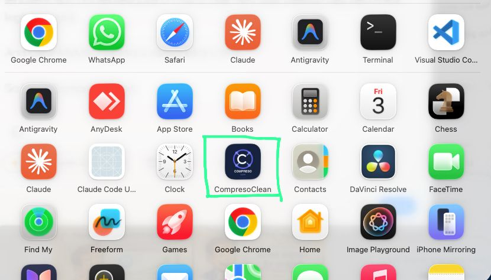
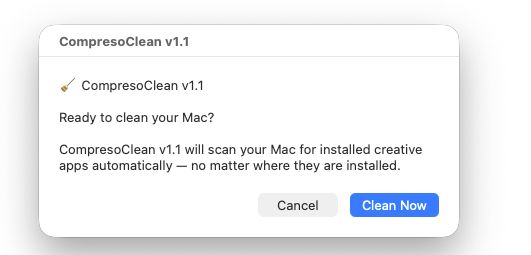
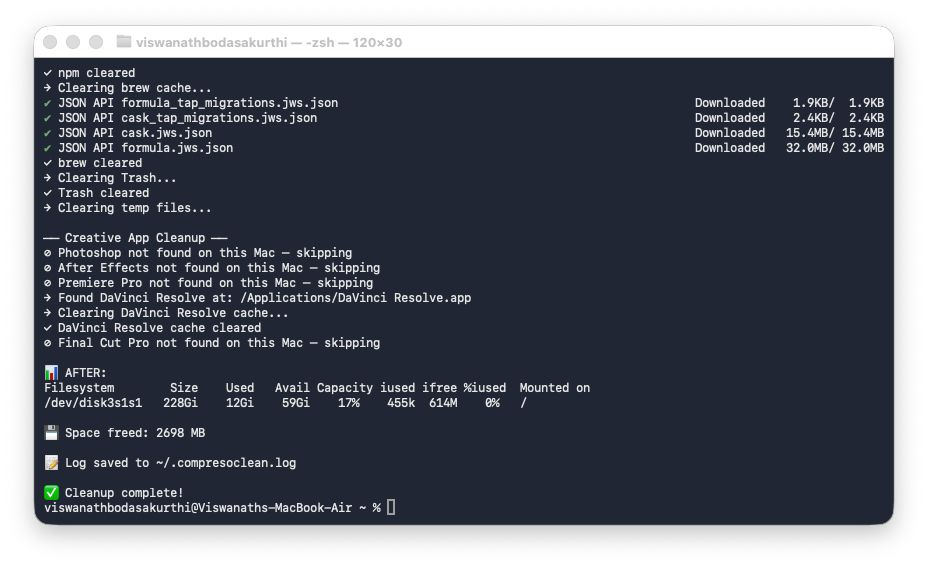
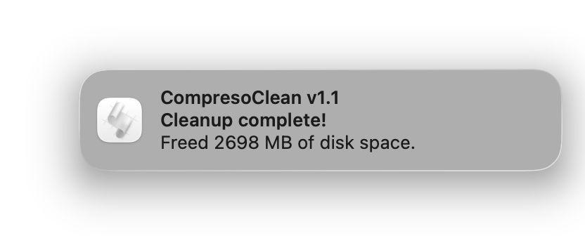

# CompresoClean

A free, no-subscription macOS cleaner for professionals.  
Built by [Viswanath Bodasakurthi](https://viswabnath.github.io/portfolio/) · [OneMark Agency](https://onemark.co.in)

> Replaces CleanMyMac — no paywalls, no accounts, no bloat.

---

## What It Does

CompresoClean is a lightweight macOS cleaning app that frees up disk space in seconds. It was built for the OneMark team and is now open-sourced for anyone who's tired of paying for software that does something a well-written shell script can do better.

| Feature | Details |
|---|---|
| Caches & Logs | Clears system caches, app logs, and temp files |
| npm & Homebrew | Prunes package manager leftovers |
| Trash | Empties system Trash |
| Creative Apps | Dynamically detects and cleans 28 creative apps across Adobe, Apple, 3D, design, audio, and photo categories |
| Dynamic Detection | Uses Spotlight (`mdfind`) — finds apps regardless of install location or version year |
| Run Logs | Every cleanup logged to `~/.compresoclean.log` with timestamps |
| Notifications | macOS notification shows MB freed after each run |
| Confirmation Dialog | Asks before cleaning — no accidental wipes |

---

## Screenshots

**App in Launchpad**  


**Confirmation dialog**  


**Terminal output during cleanup**  


**macOS notification after cleanup**  


---

## Installation

### Option 1 — Download DMG (Recommended)

1. Go to [Releases](../../releases) and download `CompresoClean_v1.2.dmg`
2. Open the DMG and drag `CompresoClean.app` to `/Applications`
3. Double-click to run

**First run:** macOS may show a security warning. Go to **System Settings > Privacy & Security** and click **Open Anyway**.

### Option 2 — Build from Source

```bash
git clone https://github.com/viswanathbodasakurthi/CompresoClean.git
cd CompresoClean
chmod +x build.sh
./build.sh
```

This assembles the `.app` bundle and outputs a DMG to `~/Desktop/CompresoClean_v1.2.dmg`.

---

## Editing the Script

The cleaner logic lives in a single shell script:

```
src/CompresoClean
```

To modify and rebuild:

```bash
# 1. Edit the script
nano src/CompresoClean

# 2. Rebuild the app + DMG
./build.sh
```

To edit directly inside the installed app:

```bash
cd /Applications/CompresoClean.app/Contents/MacOS
claude
```

---

## Repo Structure

```
CompresoClean/
├── app/
│   └── CompresoClean.app/       <- Full .app bundle (plug-and-play)
├── src/
│   └── CompresoClean            <- Standalone shell script (source of truth)
├── build.sh                     <- Assembles .app + DMG from src/
├── docs/
│   ├── instructions.md          <- Usage guide
│   └── CHANGELOG.md             <- Version history
├── .gitignore
└── README.md
```

---

## Run Log

Every cleanup is appended to:

```
~/.compresoclean.log
```

Example entry:

```
[2025-06-10 14:32:01] CompresoClean v1.2 -- Cleanup complete. 3,421 MB freed.
```

---

## Releases

| Version | Date | Notes |
|---|---|---|
| v1.2 | 2026-05 | Expanded to 28 creative apps, bundle ID detection, no-emoji terminal output |
| v1.1 | 2025-06 | Dynamic app detection, macOS notifications, run logging |
| v1.0 | 2025-05 | Initial release |

Full changelog: [docs/CHANGELOG.md](docs/CHANGELOG.md)

---

## Built With

- **Shell Script** — the entire cleaner is a single `bash` script
- **Claude Code** — used for iterative development inside the terminal
- **hdiutil** — native macOS DMG creation
- **mdfind / Spotlight** — dynamic app path detection

---

## About OneMark

OneMark is a design and engineering agency building tools, platforms, and digital products.  
This tool was built internally and open-sourced because good software should be free.

---

## License

MIT License — use it, fork it, ship it.  
Attribution appreciated but not required.

---

Built by Viswanath Bodasakurthi · OneMark Agency
